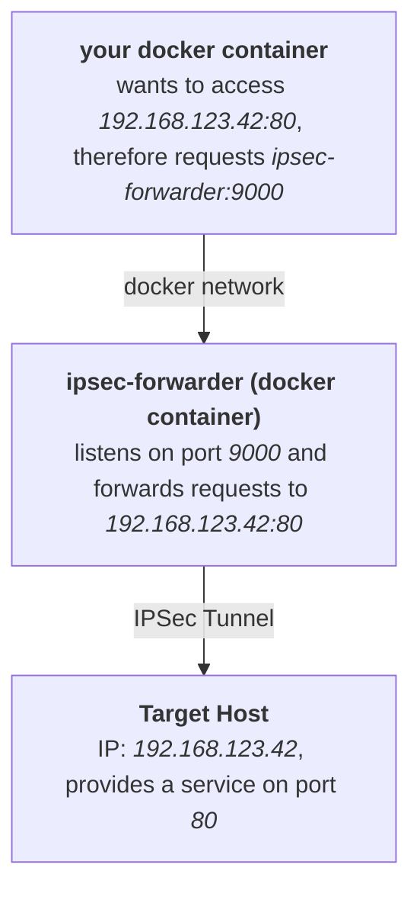

# IPSec Forwarder

Expose servers behind a VPN connection to a local Docker network

# Setup



# Deployment

```yaml
version: '3.9'

services:

  ipsec-forwarder:
    image: knrdl/ipsec-forwarder
    hostname: ipsec-forwarder
    restart: always
    environment:
      VPNC_GATEWAY: IP or qualified name of the IPSec gateway
      VPNC_ID: Group name
      VPNC_SECRET: Group password
      VPNC_USERNAME: XAUTH username
      VPNC_PASSWORD: XAUTH password
      FORWARDS: 9000:192.168.123.42:80,9001:192.168.123.42:81 # example with 2 forwards
    networks:
      - vpn_net
    cap_add:
      - NET_ADMIN  # necessary to create tunneling device

  your-container:
    image: curlimages/curl
    command: "sh -c 'sleep 10 && curl ipsec-forwarder:9000'"
    restart: always
    networks:
      - vpn_net

networks:
  vpn_net:
```
